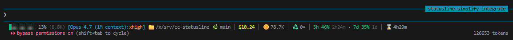

# cc-statusline

A single-file, dependency-free Claude Code status line + `PreCompact` hook,
written in Node.js. ~140 lines, one process per refresh, no jq/awk/git
shell-outs other than a 2-second `git branch --show-current`.

## Sample



```
██████████ 76% (245.0K) [Opus 4.7:xhigh] 📁 ~/projects/foo 🌿 main │ $1.23 │ 🪙 245.0K │ ♻️ 2× │ 5h 64% 4h19m · 7d 26% 3d9h │ ⌛ 12m34s
```

| Field | Meaning |
|---|---|
| `██████████ 76%` | Context window bar + percentage (green < 70, yellow < 90, red ≥ 90) |
| `(245.0K)` | Current context tokens (input + output) |
| `[Opus 4.7:xhigh]` | Model + `effortLevel` from `~/.claude/settings.json` |
| `📁 ~/...` | Working dir (`$HOME` shortened to `~`) |
| `🌿 main` | Git branch (omitted when not in a repo) |
| `$1.23` | Cumulative cost (delta-tracked across context resets) |
| `🪙 245.0K` | Cumulative tokens for the session |
| `♻️ 2×` | Number of `/compact` events in this session |
| `5h 64% 4h19m` | 5-hour quota used + countdown to reset |
| `7d 26% 3d9h` | 7-day quota used + countdown to reset |
| `⌛ 12m34s` | Session wall-clock duration |

Quota numbers are aggregated across all concurrent Claude Code sessions via
`~/.claude/rate-limit-snapshots.json`, so the display matches `/usage`
regardless of which session is currently rendering.

## Install

1. Copy `cc-statusline.js` to `~/.claude/statusline-command.js` (or anywhere
   you prefer — adjust the paths below):

   ```bash
   mkdir -p ~/.claude
   cp cc-statusline.js ~/.claude/statusline-command.js
   chmod +x ~/.claude/statusline-command.js
   ```

2. Add the following to `~/.claude/settings.json`:

   ```jsonc
   {
     "statusLine": {
       "type": "command",
       "command": "node ~/.claude/statusline-command.js",
       "refreshInterval": 30
     },
     "hooks": {
       "PreCompact": [
         {
           "matcher": ".*",
           "hooks": [
             { "type": "command", "command": "node ~/.claude/statusline-command.js" }
           ]
         }
       ]
     }
   }
   ```

   - `statusLine` — renders the bar; refreshes every 30 s (Claude Code's hard
     minimum).
   - `PreCompact` — same script, dual-mode: when stdin payload contains
     `hook_event_name === "PreCompact"` it bumps the compact counter and
     pipes stdin through; otherwise it renders.

3. Restart Claude Code (or run `:reload` in TUI). The bar appears at the
   bottom and updates each turn.

## Files it touches

| Path | Purpose |
|---|---|
| `/tmp/claude-cum-{sid}.json` | Cumulative cost / duration / tokens (delta-tracked) |
| `/tmp/claude-compacts-{sid}.json` | Compact counter (written on `PreCompact`) |
| `~/.claude/rate-limit-snapshots.json` | Cross-session 5h / 7d quota cache (≤ 5 min TTL per entry) |

All writes are atomic (write-tmp + rename). Crash-safe and concurrent-safe
under typical Claude Code usage; no locks needed.

## Customise

- **Effort colours** — edit the `effortColor` map (`low/default/medium`,
  `high`, `xhigh`, `max`).
- **Reset countdown format** — edit `fmtDur` (`1d3h` / `1h30m` / `30m20s`).
- **Emoji** — change inline emoji in the final `process.stdout.write`.
- **Drop a field** — delete the corresponding section in the `process.stdout.write` call.

## Requirements

- Node.js ≥ 14 (uses optional chaining and nullish coalescing only).
- A terminal with truecolor + emoji rendering. ⌛ and ♻️ are picked for broad
  font support; swap if your font lacks them.

---

# 中文（繁體）

單檔、零依賴的 Claude Code 狀態列 + `PreCompact` hook，以 Node.js 撰寫。
約 140 行，每次刷新只 fork 一個 process（除了一個 2 秒 timeout 的
`git branch --show-current`）。

## 範例


```
██████████ 76% (245.0K) [Opus 4.7:xhigh] 📁 ~/projects/foo 🌿 main │ $1.23 │ 🪙 245.0K │ ♻️ 2× │ 5h 64% 4h19m · 7d 26% 3d9h │ ⌛ 12m34s
```

| 欄位 | 說明 |
|---|---|
| `██████████ 76%` | Context 進度條 + 百分比（< 70 綠、< 90 黃、≥ 90 紅） |
| `(245.0K)` | 當前 context token 數（input + output） |
| `[Opus 4.7:xhigh]` | 模型 + `~/.claude/settings.json` 的 `effortLevel` |
| `📁 ~/...` | 工作目錄（`$HOME` 簡寫為 `~`） |
| `🌿 main` | Git 分支（非 repo 時自動隱藏） |
| `$1.23` | 累計成本（跨 context reset 用 delta 演算法持續累加） |
| `🪙 245.0K` | 本 session 累計 token 數 |
| `♻️ 2×` | 本 session 觸發 `/compact` 的次數 |
| `5h 64% 4h19m` | 5 小時配額用量 + 重置倒數 |
| `7d 26% 3d9h` | 7 天配額用量 + 重置倒數 |
| `⌛ 12m34s` | 本 session 累計工時 |

5h / 7d 配額會跨所有同時開啟的 Claude Code session 透過
`~/.claude/rate-limit-snapshots.json` 聚合，無論由哪個 session render，
顯示的數字都會與 `/usage` 一致。

## 安裝

1. 把 `cc-statusline.js` 複製到 `~/.claude/statusline-command.js`（或你
   喜歡的位置，下面路徑同步調整）：

   ```bash
   mkdir -p ~/.claude
   cp cc-statusline.js ~/.claude/statusline-command.js
   chmod +x ~/.claude/statusline-command.js
   ```

2. 把以下內容加進 `~/.claude/settings.json`：

   ```jsonc
   {
     "statusLine": {
       "type": "command",
       "command": "node ~/.claude/statusline-command.js",
       "refreshInterval": 30
     },
     "hooks": {
       "PreCompact": [
         {
           "matcher": ".*",
           "hooks": [
             { "type": "command", "command": "node ~/.claude/statusline-command.js" }
           ]
         }
       ]
     }
   }
   ```

   - `statusLine` — 渲染狀態列，每 30 秒刷新（Claude Code 的硬下限）。
   - `PreCompact` — 同一個檔，雙模式：當 stdin payload 含
     `hook_event_name === "PreCompact"` 時遞增 compact 計數並把 stdin
     原樣通過；否則進入 render 流程。

3. 重啟 Claude Code（或在 TUI 內執行 `:reload`）。狀態列會出現在底部
   並隨每回合更新。

## 寫入的檔案

| 路徑 | 用途 |
|---|---|
| `/tmp/claude-cum-{sid}.json` | 累計成本／工時／token（delta 演算法） |
| `/tmp/claude-compacts-{sid}.json` | compact 次數（PreCompact 時遞增） |
| `~/.claude/rate-limit-snapshots.json` | 跨 session 的 5h / 7d 配額快照（每筆 5 分鐘 TTL） |

寫入都採 atomic（寫 tmp 後 rename）。Claude Code 一般使用情境下對 crash
與併發都安全，不需鎖。

## 客製

- **Effort 顏色** — 修改 `effortColor` 對應表（`low/default/medium`、
  `high`、`xhigh`、`max`）。
- **倒數格式** — 修改 `fmtDur`（`1d3h` / `1h30m` / `30m20s`）。
- **Emoji** — 修改最後 `process.stdout.write` 內的 inline emoji。
- **拿掉某欄位** — 直接從 `process.stdout.write` 那行刪掉對應段落。

## 需求

- Node.js ≥ 14（只用到 optional chaining 與 nullish coalescing）。
- 支援 truecolor 與 emoji 的終端機。⌛ 與 ♻️ 為相容性考量挑選，若字型
  不支援可自行替換。
